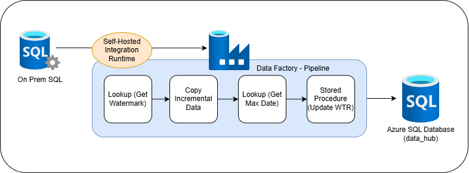
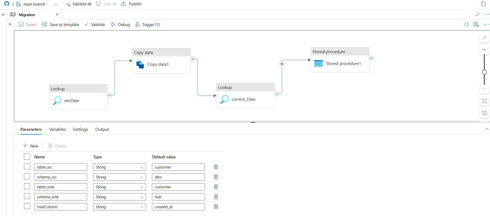

# OnPrem2CloudDataPipeline

## Overview
This project demonstrates an end-to-end **on-premises to cloud data migration**
solution using **Azure Data Factory (ADF)**.  
The pipeline uses a **watermark-based incremental loading strategy** to migrate
data from an on-prem SQL Server to an Azure SQL Database in a **reliable,
restartable, and production-ready** manner.

---

## Architecture Diagram

The solution follows a hybrid integration architecture where on-premises data
is securely transferred to Azure using a **Self-Hosted Integration Runtime (SHIR)**.

### Architecture Components
- On-Prem SQL Server (Source)
- Self-Hosted Integration Runtime
- Azure Data Factory
- Azure SQL Database (Target – `data_hub`)
- Watermark control table (`dbo.wtr`)
- Stored procedure for watermark updates

---

## Source & Target Setup

### On-Prem SQL Server
- Tables:
  - `customer`
  - `orders`

### Azure SQL Database
- Database: `data_hub`
- Schema: `hub`
- Tables:
  - `hub.customer`
  - `hub.orders`

### Watermark Table
- `dbo.wtr`
- Stores last successful load timestamp (`last_uploaded`)
- Enables incremental data processing

---

## ADF Pipeline Design

### Pipeline Name
`migration`

### Pipeline Flow
1. **Lookup – Get Watermark**  
   Reads the last successfully loaded timestamp for the given table
   from the watermark table.

2. **Copy Activity – Incremental Load**  
   Copies only new or updated records from on-prem SQL Server
   using the condition:

3. **Lookup – Get Max Loaded Date**  
Retrieves the maximum `updated_date` from the target Azure SQL table
to ensure only successfully loaded data updates the watermark.

4. **Stored Procedure – Update Watermark**  
Updates the watermark table (`dbo.wtr`) with the new `last_uploaded` value.

---

## Incremental Loading Strategy
- Watermark-based incremental design
- Uses `DATETIME2` precision to avoid data loss
- Watermark updated **only after successful data copy**
- Pipeline is safe to re-run in case of failures

---

## Scheduling
- Pipeline is triggered using a **Schedule Trigger (Daily)**
- Automatically migrates new or updated data from on-prem to cloud

---

## Technologies Used
- Azure Data Factory
- Azure SQL Database
- On-Prem SQL Server
- Self-Hosted Integration Runtime
- T-SQL
- GitHub

---

## Key Highlights
- Hybrid on-prem to cloud data migration
- Parameterized and reusable ADF pipeline
- Fault-tolerant and restartable design
- Production-grade incremental loading pattern

👤 Author

Sumit Vishwakarma
📅 Completed: February 2026

---

⭐️ If you found this project useful, give it a star on GitHub!

